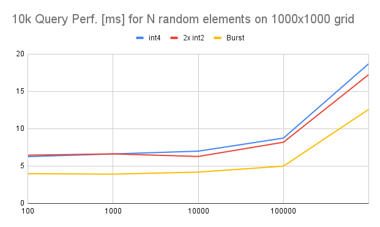
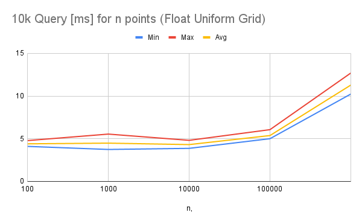

# An implementation (for Unity) of efficient spatial data structures from [Stackoverflow thread](https://stackoverflow.com/questions/41946007/efficient-and-well-explained-implementation-of-a-quadtree-for-2d-collision-det#)

[Unity project](https://github.com/nobnak/Test-EffSpaceUnity) of this module.

## Demo
[](https://www.youtube.com/shorts/0fxcMapOaBQ)
[](https://www.youtube.com/shorts/_xvoNZ3kExc)

## Usage

```csharp
using EffSpace.Extensions;
using EffSpace.Models;
using Unity.Mathematics;

var n = 100000;
var screen = new float2(1920, 1080);
var hCellCount = 1 << 5;

FPointGridExt.RecommendGrid(screen, hCellCount, out var cellCount, out var cellSize);
var fieldSize = cellSize * cellCount

var grid = new FPointGrid(cellCount, cellSize, float2.zero);
var elements = new List<int>();
var points = new List<float2>();

var rand = Unity.Mathematics.Random.CreateFromIndex(31);
for (var id = 0; id < n; id++) {
    var position = new float2(rand.NextFloat2(screen));
    var element_id = grid.Insert(id, position);
    elements.Add(element_id);
    points.Add(position);
}

foreach(var element_id in grid.Query(points[0] - cellSize, points[0] + cellSize))
    ;
```

## Data Structures
- Uniform Grid : 
  - [PointGrid](Runtime/Models/PointGrid.cs) (int2) 
  - [FPointGrid](Runtime/Models/FPointGrid.cs) (float2) 
- QuadTree: TODO

## Performance
On Razer Blade stealth 13 (2020)
- Core i7-1165G7
- Unity 2020.3

### Point Grid



## References
1. user4842163, [Efficient (and well explained) implementation of a Quadtree for 2D collision detection](https://stackoverflow.com/questions/41946007/efficient-and-well-explained-implementation-of-a-quadtree-for-2d-collision-det# ), Stackoveflow, 2018
2. Mark Farragher, [What Is Faster In C#: An int[] or an int[,]?](https://mdfarragher.medium.com/high-performance-arrays-in-c-2d55c04d37b5), 2019
