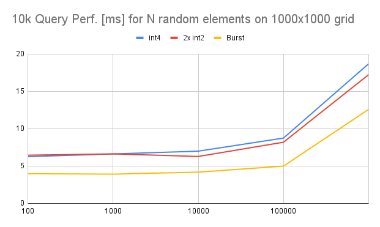
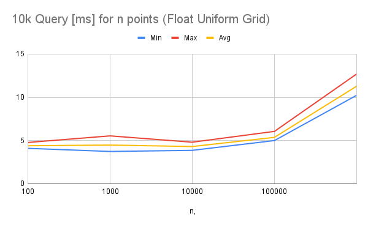

# EffSpaceUnity

Unity implementation of **efficient 2D spatial indexing** (uniform grid with per-cell linked lists), based on the approach discussed in [this Stack Overflow thread](https://stackoverflow.com/questions/41946007/efficient-and-well-explained-implementation-of-a-quadtree-for-2d-collision-det#). The runtime library is published as the UPM package **`jp.nobnak.effspace`** ([OpenUPM](https://openupm.com/packages/jp.nobnak.effspace/?subPage=readme)).

A separate sample-focused project: [Test-EffSpaceUnity](https://github.com/nobnak/Test-EffSpaceUnity).

## Table of contents

- [Overview](#overview)
- [Requirements](#requirements)
- [Installation (OpenUPM)](#installation-openupm)
- [What you get](#what-you-get)
- [Algorithm](#algorithm)
- [Usage](#usage)
- [Demo](#demo)
- [Performance](#performance)
- [References](#references)

## Overview

- **Uniform grid** — O(1) cell lookup; each cell stores a singly linked list of element indices.
- **`PointGrid`** — Integer lattice (`int2` positions, fixed cell size in integer space).
- **`FPointGrid`** — World-space `float2`; maps to the internal `PointGrid` via a fixed int scale (see `FPointGrid.intCellSize`).
- **Queries** — AABB overlap over grid cells; optional exact test on stored positions.
- **Roadmap** — QuadTree: TODO.

## Requirements

- **Unity** — Use a version compatible with the package version you install (this repo is maintained on **2022.3 LTS**; check [`Packages/jp.nobnak.effspace/package.json`](Packages/jp.nobnak.effspace/package.json) on OpenUPM for dependency versions).
- **`com.unity.mathematics`**
- **`jp.nobnak.gist2`**, **`jp.nobnak.llgraphics`** (declared dependencies of `jp.nobnak.effspace`; resolve via the same OpenUPM scope when needed)

## Installation (OpenUPM)

Same scoped-registry flow as other `jp.nobnak.*` packages (e.g. [urp-CircleRenderer](https://github.com/nobnak/urp-CircleRenderer)).

### 1. Add scoped registry

1. Open **Edit → Project Settings → Package Manager**.
2. Under **Scoped Registries**, click **+** and set:

   | Field     | Value                       |
   | --------- | --------------------------- |
   | Name      | OpenUPM                     |
   | URL       | https://package.openupm.com |
   | Scope(s)  | `jp.nobnak`                 |

3. Click **Save**.

### 2. Add the package

1. Open **Window → Package Manager**.
2. Set **Packages:** to **My Registries** (or any list that includes OpenUPM).
3. Select **Efficient Spatial Data Structure** (`jp.nobnak.effspace`) and click **Install**.

Or use **Add package by name** and enter:

`jp.nobnak.effspace`

**Package page:** [openupm.com/packages/jp.nobnak.effspace](https://openupm.com/packages/jp.nobnak.effspace/)

### This repository

`Packages/jp.nobnak.effspace/` is the embedded package source; use this repo to develop the package or run local samples. For a minimal consumer project, installing from OpenUPM is enough.

## What you get

| Area        | Summary |
| ----------- | ------- |
| Grids       | [`PointGrid`](Packages/jp.nobnak.effspace/Runtime/Models/PointGrid.cs) (`int2`), [`FPointGrid`](Packages/jp.nobnak.effspace/Runtime/Models/FPointGrid.cs) (`float2`) |
| Core types  | [`Element`](Packages/jp.nobnak.effspace/Runtime/Models/Element.cs), [`LinkedElementNode`](Packages/jp.nobnak.effspace/Runtime/Models/LinkedElementNode.cs), [`FreeList<T>`](Packages/jp.nobnak.effspace/Runtime/Collections/FreeList.cs) |
| Extensions  | [`PointGridExt`](Packages/jp.nobnak.effspace/Runtime/Extensions/PointGridExt.cs), [`FPointGridExt`](Packages/jp.nobnak.effspace/Runtime/Extensions/FPointGridExt.cs) (`RecommendGrid`, coordinate mapping, Burst-friendly helpers) |
| Interfaces  | [`IPointField<TPos>`](Packages/jp.nobnak.effspace/Runtime/Interfaces/IPointField.cs), add/remove handlers |

Namespace: **`EffSpace.*`**

## Algorithm

1. **Partitioning** — The domain is split into a regular 2D grid. A point’s cell index is derived from its position and cell size (`PointGrid` uses integer math; `FPointGrid` converts `float2` → scaled `int2` first).
2. **Insertion** — Allocate an `Element` (user `id` + lattice position), push a `LinkedElementNode` onto that cell’s list head in `grid[]`. Invalid / out-of-bounds positions can yield a sentinel “no element” index (see constants in [`C`](Packages/jp.nobnak.effspace/Runtime/Constants/C.cs)).
3. **Removal** — Walk the cell’s linked list, unlink the node, recycle indices via `FreeList`.
4. **Query** — Convert query AABB to cell index range, iterate touched cells, traverse each list, yield elements whose stored position lies inside the query AABB.

Average-case neighbor search is good when particles are evenly spread; worst-case degrades if many objects pile into the same cell.

## Usage

### Initialize

```csharp
var verticalCellCount = 1 << 5;
var particleCount = 1000;
var screenSize = new int2(1920, 1080);
FPointGridExt.RecommendGrid(screenSize, verticalCellCount, out var cellCount, out var cellSize);
var grid = new FPointGrid(cellCount, cellSize, float2.zero);

for (var i = 0; i < particleCount; i++) {
    var pos = rand.NextFloat2(float2.zero, screenSize);
    element_ids[i] = grid.Insert(i, pos);
    particle_seeds[i] = pos;
    particle_pos[i] = pos;
    ...
}
```

### Update

```csharp
var t = Time.time;
for (var i = 0; i < particleCount; i++) {
    var element_id = element_ids[i];
    var seed = particle_seeds[i];
    var pos = particle_pos[i];
    if (element_id >= 0) grid.Remove(element_id);

    pos += dt * screenSize * new float2(
        noise.snoise(new float3(seed, t)),
        noise.snoise(new float3(-seed, t)));
    pos -= screenSize * math.floor(pos / screenSize);

    element_ids[i] = grid.Insert(i, pos);
    particle_pos[i] = pos;
}
```

### Query

```csharp
int Nearest(int i) {
    var pos = particle_pos[i];
    var element_id = element_ids[i];
    var min_dist_sq = float.MaxValue;
    var min_id = -1;
    foreach (var e in grid.Query(pos - qrange, pos + qrange)) {
        if (e == element_id) continue;

        var eq = grid.grid.elements[e];
        var pos1 = particle_pos[eq.id];
        var dist_sq = math.distancesq(pos1, pos);
        if (dist_sq < min_dist_sq) {
            min_dist_sq = dist_sq;
            min_id = e;
        }
    }
    return min_id;
}
```

## Demo

[](https://www.youtube.com/shorts/0fxcMapOaBQ)
[](https://www.youtube.com/shorts/_xvoNZ3kExc)

## Performance

On Razer Blade Stealth 13 (2020)

- Core i7-1165G7
- Unity 2020.3

### Point grid




## References

1. user4842163, [Efficient (and well explained) implementation of a Quadtree for 2D collision detection](https://stackoverflow.com/questions/41946007/efficient-and-well-explained-implementation-of-a-quadtree-for-2d-collision-det#), Stack Overflow, 2018
2. Mark Farragher, [What Is Faster In C#: An int[] or an int[,]?](https://mdfarragher.medium.com/high-performance-arrays-in-c-2d55c04d37b5), 2019
