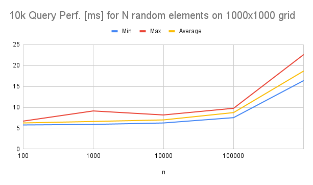

# An implementation (for Unity) of efficient spatial data structures from [Stackoverflow thread](https://stackoverflow.com/questions/41946007/efficient-and-well-explained-implementation-of-a-quadtree-for-2d-collision-det#)

[Unity project](https://github.com/nobnak/Test-EfficientSpatialDataStructureUnity) of this module.

## Data Structures
- Uniform Grid : 
  - [PointGrid](Runtime/Models/PointGrid.cs) (int) 
- QuadTree: TODO

## Performance
### Point Grid

## References
1. user4842163, [Efficient (and well explained) implementation of a Quadtree for 2D collision detection](https://stackoverflow.com/questions/41946007/efficient-and-well-explained-implementation-of-a-quadtree-for-2d-collision-det# ), Stackoveflow, 2018
2. Mark Farragher, [What Is Faster In C#: An int[] or an int[,]?](https://mdfarragher.medium.com/high-performance-arrays-in-c-2d55c04d37b5), 2019
